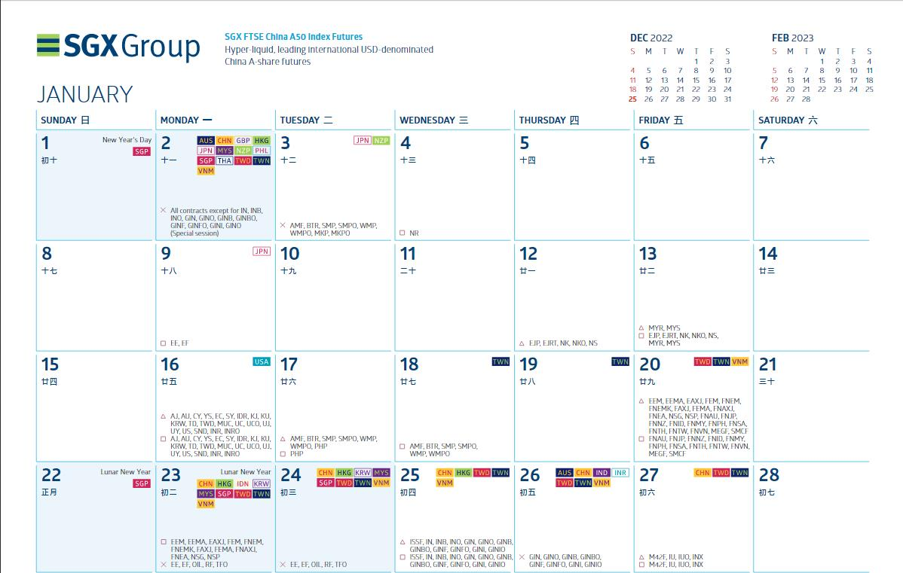
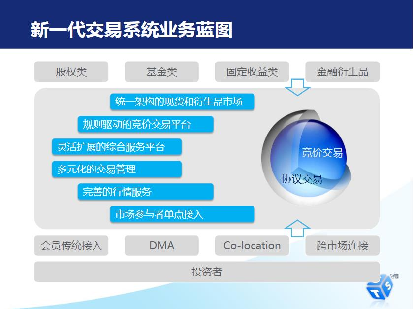
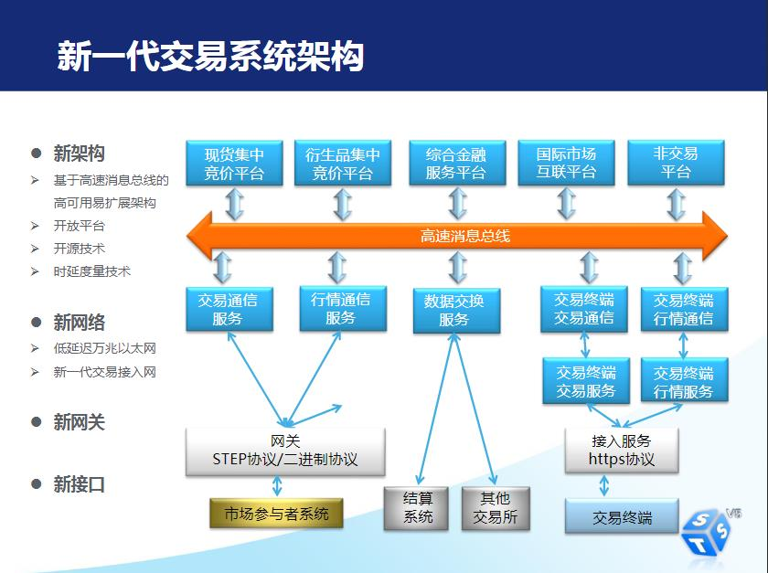
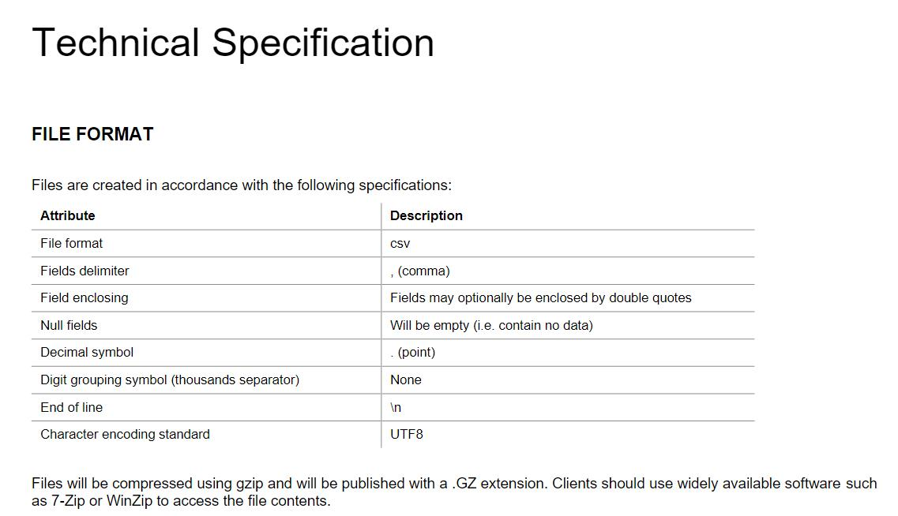
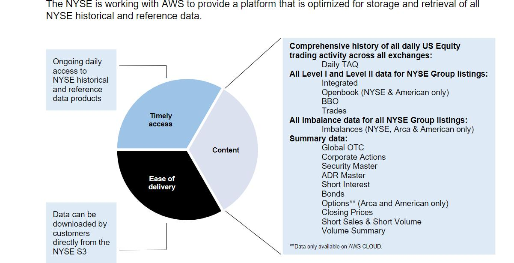

# awesome-stock-exchange-info

笔者在工作需要经常查询交易所的一些规则、接口等，经常会出现下面的情况：

- 有时接口版本更新等原因，下载到本地的资料不是最新的；
- 有些资料从网站查询之后又忘记了；
- 还有些环境配置等在某个文档里面，查询更新的时候又忘记了。

年纪大了。好记性不如烂笔头，对于国内外主流交易所业务规则、接口规范、指引、环境配置等进行汇总，便于查阅使用。

# 业务规则

本章内容包含了交易所股票、债券交易、上市规则等信息。

- 上市规则

	-[上市规则](./业务规则/上市规则/readme.md): 对于主要交易所上市规则等进行梳理

- 交易规则

	-[交易规则](./业务规则/交易规则/readme.md): 对于主要交易所交易规则等进行梳理

# 接入服务指引

本章内容包含了交易所行情、交易环境接入环境、流程等指引。

[交易所接入服务指引](./接入服务/readme.md): 主要交易所系统、环境接入汇总

# 技术接口

本章内容包含了主要交易所技术接口规范。

[交易所技术接口](./技术接口/readme.md)：主要交易所行情数据、交易等接口规范。

## 纽交所

产品服务：[产品服务介绍](https://www.nyse.com/data-products)

主要包括的数据产品有：

-  [实时数据](https://www.nyse.com/market-data/real-time)
- [历史数据](https://www.nyse.com/market-data/historical)
- [公司事件](https://www.nyse.com/market-data/corporate-actions)
- [公司交易活动](https://www.nyse.com/market-data/reference)

根据不同的类型提供影响规范，比如实时数据：

- 股票通用用户规范：[Pillar Equities Common Client Specification](https://www.nyse.com/publicdocs/nyse/data/NYSE_Pillar_Equities_Common_Client_Specification.pdf)

- 集成订阅用户规范：[Integrated Feed Client Specification](https://www.nyse.com/publicdocs/nyse/data/NYSE_Pillar_Integrated_Feed_Client_Specification.pdf)

历史数据：

- TAQ 数据订阅：[TAQ Pillar Products Client Specification](https://www.nyse.com/publicdocs/nyse/data/TAQ_Pillar_Products_Client_Spec_v2.3i.pdf)

  

## 新加坡交易所

技术规范：[技术规范](https://www.sgx.com/sgx-reach)

基本接入架构如下：

## 伦交所

技术规范：[技术规范](https://www.londonstockexchange.com/resources/securities-trading-resources?tab=technical-library&accordionId=0-2b510a0f-6659-4507-b35e-f97eaa476ffb&moduleId=block_content%3Abc3f1d6a-786e-4c90-af45-d308eb653746)

# 软件下载

本章内容包括了行情、交易等软件下载信息。

[软件下载](./软件下载/readme.md) 交易所行情、交易、文件网关下载

# 交易日历

深交所交易日历：[交易日历](http://www.szse.cn/aboutus/calendar/index.html)

上交所交易日历：[交易日历](http://www.sse.com.cn/disclosure/dealinstruc/closed/)

港交所交易日历：[交易日历](https://sc.hkex.com.hk/TuniS/www.HKEX.com.hk/News/HKEX-Calendar?sc_lang=zh-CN)

欧交所交易日历：[交易日历](https://www.eurex.com/ex-en/trade/trading-calendar)

- 觉得他们的网站日历展示不错，可以按照不同的产品进行查询。

新加坡交易所：[交易日历](https://www.sgx.com/derivatives/trading)

- 通过日历标识每天的交易状态：

  

​	

# 技术架构

## 深交所

### 系统介绍

[深交所五版交易系统介绍](https://www.szse.cn/marketServices/technicalservice/introduce/)

业务蓝图：

系统架构：

### 参考链接

[第五代交易系统介绍](https://www.szse.cn/marketServices/technicalservice/introduce/)

[深交所码农眼中的第五代交易系统](https://www.szse.cn/aboutus/sse/documents/P020180328486251814979.pdf)

[深交所关键信息基础设施安全运营实践](https://www.secrss.com/articles/16971)

# 交易所研究

[全球主要交易所系列研究之洲际交易所集团（纽交所）](http://www.sse.com.cn/aboutus/research/report/c/5300349.pdf)

[全球主要交易所系列研究之德国交易所集团](http://www.sse.com.cn/aboutus/research/report/c/5300348.pdf)

# 交易所技术/平台
不同交易所采用的协议不同。对于主要交易所协议进行汇总。
## Nasdaq
[SoupBinTCP](https://www.nasdaq.com/docs/SoupBinTCP%204.1.pdf)
[Nordic OUCH 5 Specification](https://www.nasdaq.com/docs/2022/11/09/OUCH5-for-Nasdaq-Nordic-5.01.4_0.pdf)
### 市场数据源
[Nasdaq Market Data Feeds](https://www.nasdaq.com/solutions/nasdaq-market-data-feeds)
按照不同的分类包含了：
- [股票市场](https://www.nasdaq.com/solutions/nasdaq-equities-market-data-solution)
- [期权、期货市场](https://www.nasdaq.com/solutions/nasdaq-options-and-futures-market-data)
- [固定收益](https://www.nasdaq.com/solutions/fixed-income-market-data-reference-data-base)
- [商品](https://www.nasdaq.com/solutions/nasdaq-commodities-data)
- [指数](https://www.nasdaq.com/solutions/nasdaq-index-data-solution)
- [多资产](https://www.nasdaq.com/solutions/nasdaq-data-multi-asset-classes)

## 伦敦交易所集团
伦交所市场数据传输包含多个方面，不同数据分类规范不同。
### 历史数据产品
[历史数据产品](https://www.londonstockexchange.com/securities-trading/market-data/historical-data-products)
包含历史订单数据等，主要是通过文件方式对外提供：

### 实时数据
[实时数据概述](https://www.londonstockexchange.com/securities-trading/market-data/real-time-data-overview)
[Group Ticker Plant (GTP)](https://www.londonstockexchange.com/securities-trading/market-data/group-ticker-plant) 通过GTP平台进行数据发布
[Group Ticker Plant - Technical Specifications](https://www.londonstockexchange.com/resources/security-trading-resources/gtp-technical-specifications) GTP平台接口规范
## 纽交所
[数据产品概述](https://www.nyse.com/data-products) 
主要包含了实时数据、历史数据、公司事件、参考数据等
[NYSE Pillar平台](https://www.nyse.com/market-data/real-time/integrated-feed)

AWS云服务

纽交所通过和亚马逊云平台AWS的合作，可以让用户能够大规模的历史和参数数据。主要优势如下：

- 下载速度

  随着成交量增加、数据文件大小的递增，下载速度和效率已成为客户工作流程的一个重要方面，
  通过亚马逊云平台获取历史数据相较传统的SFTP传输系统速度快。

- 运营开销

  从SFTP下载文件、处理数据、将数据存储在本地或者存储到云供应商都需要一些工作；
  通过AWS云服务，用户可以花更少的时间和费用来维护基础设施。

  

[金融数据合规与金融云安全](https://aws.amazon.com/cn/financial-services/security-compliance/) 

## 德交所

[交易平台](https://www.eurex.com/ex-en/support/technology/t7)

# 应急处置

## 德交所集团

主要交易所应急处置手册、方案。

[Exchange Playbooks On Outage Protocols In Equity Markets](https://www.marketsmedia.com/exchange-playbooks-on-outage-protocols-in-equity-markets/)

[Euronext Playbook for Incident Management](https://connect2.euronext.com/en/media/1390/download) 泛欧交易所应急处置手册

[Emergency-Playbook-Incident-Handling](https://www.xetra.com/resource/blob/2798788/554d287b6756ef5e60856c6e491e15ea/data/Emergency-Playbook-Incident-Handling.pdf) 德交所应急处置手册

[emergency-procedures](https://www.xetra.com/xetra-en/technology/t7/emergency-procedures) T7交易系统应急处置手册

[德交所集团T7交易系统风险处置指南分析](https://mp.weixin.qq.com/s?__biz=MzAwOTcyNDI3MA==&mid=2649048209&idx=1&sn=b50c8839f6f6e6f7f5af2d0249f55a77&chksm=834aac90b43d25867da993aba0351fc75af58e6e71d9f69b1c362e6a1824d28993629a75238e&token=1959441179&lang=zh_CN#rd)

## 西班牙交易所

[BME'S EQUITY TRADING SYSTEMS INCIDENT HANDLING](https://www.bolsasymercados.es/bme-exchange/docs/docsSubidos/Market-Status/Outages-protocols-BME-Equity-Systems.pdf) 西班牙交易所应急处置协议和标准

## 保加利亚交易所
[Emergency Playbook – Incident Handling Standards and best practices defined by Bulgarian Stock Exchange](https://download.bse-sofia.bg/BSE-Rules/Playbook_on_outages_2022.04.12_en.pdf)

