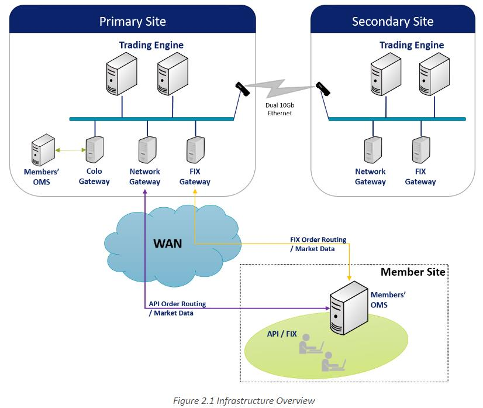

# awesome-stock-exchange-info

笔者在工作需要经常查询交易所的一些规则、接口等，经常会出现下面的情况：

- 有时接口版本更新等原因，下载到本地的资料不是最新的；
- 有些资料从网站查询之后又忘记了；
- 还有些环境配置等在某个文档里面，查询更新的时候又忘记了。

年纪大了。好记性不如烂笔头，对于国内外主流交易所业务规则、接口规范、指引、环境配置等进行汇总，便于查阅使用。

# 业务规则

本章内容包含了交易所股票、债券交易、上市规则等信息。

- 上市规则

	-[上市规则](./业务规则/上市规则/readme.md): 对于主要交易所上市规则等进行梳理

- 交易规则

	-[交易规则](./业务规则/交易规则/readme.md): 对于主要交易所交易规则等进行梳理

# 接入服务指引

本章内容包含了交易所行情、交易环境接入环境、流程等指引。

[交易所接入服务指引](./接入服务/readme.md): 主要交易所系统、环境接入汇总

# 技术接口规范

本章内容包含了主要交易所技术接口规范。

[交易所技术接口](./技术接口/readme.md)：主要交易所行情数据、交易等接口规范。	

## 纽交所

产品服务：[产品服务介绍](https://www.nyse.com/data-products)

主要包括的数据产品有：

-  [实时数据](https://www.nyse.com/market-data/real-time)
- [历史数据](https://www.nyse.com/market-data/historical)
- [公司事件](https://www.nyse.com/market-data/corporate-actions)
- [公司交易活动](https://www.nyse.com/market-data/reference)

根据不同的类型提供影响规范，比如实时数据：

- 股票通用用户规范：[Pillar Equities Common Client Specification](https://www.nyse.com/publicdocs/nyse/data/NYSE_Pillar_Equities_Common_Client_Specification.pdf)

- 集成订阅用户规范：[Integrated Feed Client Specification](https://www.nyse.com/publicdocs/nyse/data/NYSE_Pillar_Integrated_Feed_Client_Specification.pdf)

历史数据：

- TAQ 数据订阅：[TAQ Pillar Products Client Specification](https://www.nyse.com/publicdocs/nyse/data/TAQ_Pillar_Products_Client_Spec_v2.3i.pdf)

  

## 新加坡交易所

技术规范：[技术规范](https://www.sgx.com/sgx-reach)

基本接入架构如下：

# 软件下载

本章内容包括了行情、交易等软件下载信息。

[软件下载](./软件下载/readme.md) 交易所行情、交易、文件网关下载

# 交易日历

对于主要交易所交易日历信息进行汇总。

[交易日历](./交易日历/readme.md) 交易日历

# 技术架构

对于交易所技术架构进行整理。

[技术架构](./技术架构/readme.md)： 交易所技术架构汇总。

# 交易所研究

针对全球交易所的研究报告。

[研究报告](./研究报告/readme.md)：上交所针对全球交易所的研究报告

# 技术平台
不同交易所采用的协议不同。对于主要交易所协议进行汇总。

[技术平台](./技术平台/readme.md)：不同技术平台信息汇总

# 应急处置

交易所应急处置规范汇总。

[应急处置](./应急处置/readme.md)：主要交易所应急处置规范汇总。