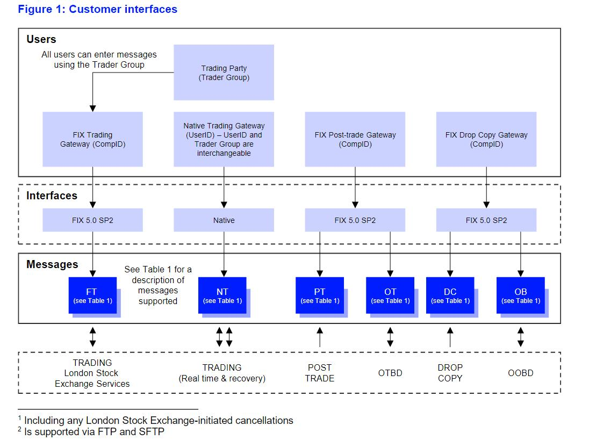
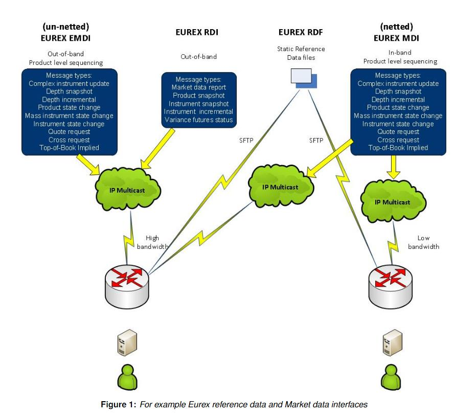
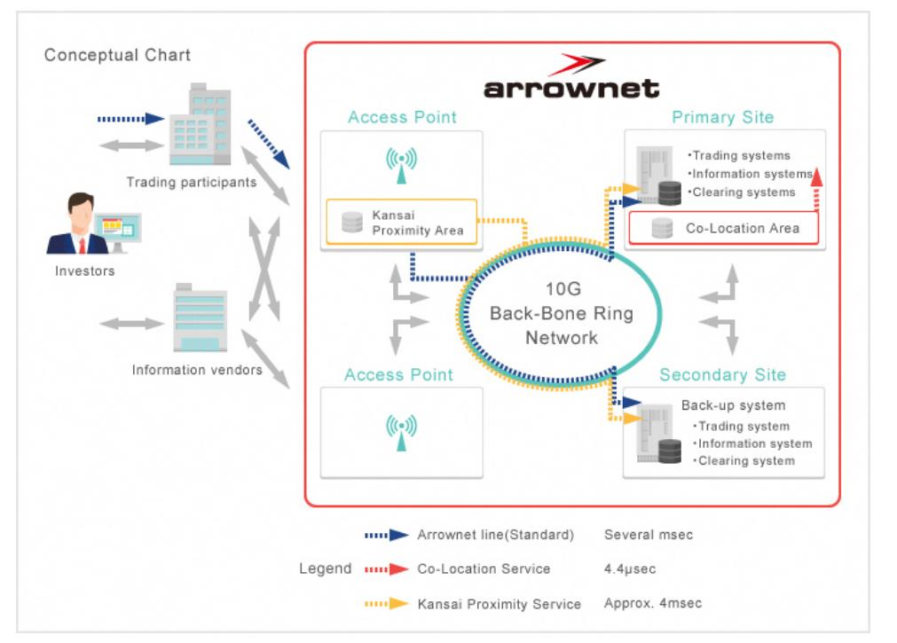

# awesome-stock-exchange-info

笔者在工作需要经常查询交易所的一些规则、接口等，经常会出现下面的情况：

- 有时接口版本更新等原因，下载到本地的资料不是最新的；
- 有些资料从网站查询之后又忘记了；
- 还有些环境配置等在某个文档里面，查询更新的时候又忘记了。

年纪大了。好记性不如烂笔头，对于国内外主流交易所业务规则、接口规范、指引、环境配置等进行汇总，便于查阅使用。

# 业务规则

本章内容包含了交易所股票、债券交易等规则。

## 上市规则

### 港交所

上市规则：[上市规则](https://sc.hkex.com.hk/TuniS/www.HKEX.com.hk/Listing/Rules-and-Guidance/Listing-Rules?sc_lang=zh-CN)

## 交易规则

### 上交所

规则体系概述：[规则体系概述](http://www.sse.com.cn/lawandrules/sselawsrules/overview/)

### 深交所

最新规则：[最新规则](https://www.szse.cn/lawrules/rule/new/index.html)

### 港交所

最新规则：[规则概述](https://sc.hkex.com.hk/TuniS/www.HKEX.com.hk/Services/Rules-and-Forms-and-Fees/Rules/Overview?sc_lang=zh-CN)

### 北交所

规则入口：[交易管理](https://www.bse.cn/business/jygl_list.html)

### 新加坡交易所

交易规则入口：[交易规则](https://www.sgx.com/securities/trading)

### 伦交所

交易规则入口：[交易规则](https://www.londonstockexchange.com/resources/securities-trading-resources?tab=rules-and-regulations)

### 欧洲交易所

交易规则入口：[交易规则](https://www.eurex.com/ex-en/rules-regs/eurex-rules-regulations)

### 多伦多证券交易所集团

交易规则入口： [交易规则](https://www.tmx.com/tmx-group/regulatory-policies)

### 日本交易所集团

交易规则入口：[交易规则](https://www.jpx.co.jp/english/rules-participants/rules/regulations/index.html)

# 接入服务指引

本章内容包含了交易所行情、交易环境接入环境、流程等指引。

## 上交所

系统接入：[上海证券交易所会员交易及相关系统接入与应用指引](http://www.sse.com.cn/services/tradingtech/services/c/SSE_TradeSystem_20200221.docx)

测试环境接入：[上海证券交易所全天候测试环境使用指引_20141215](http://www.sse.com.cn/services/tradingtech/services/c/SSE_TestingEnvironmentGuide_20141215.doc.doc)

QQ群服务：[上海证券交易所技术支持服务群使用指引(2016年1月版)](http://www.sse.com.cn/services/tradingtech/services/c/SSE_TechSupportIMGroupGuide_20160122.doc)

网关及专用数字证书服务: [网关及专用数字证书服务指南V1.0](http://www.sse.com.cn/services/tradingtech/services/c/SSE_KEY_TechnicalGuide_CV1.0_20220805.pdf)

期权及专用数字证书服务：[交易网关（期权）及专用证书开通申请指南](http://www.sse.com.cn/services/tradingtech/services/c/TDGW(DTP)_Key_Guide_20201215.pdf)

## 深交所

系统接入：[会员及其他相关单位访问深交所交易系统接入服务技术规范（Ver1.02）](http://www.szse.cn/marketServices/technicalservice/serveGuide/P020200403635505892547.pdf)

网关部署及接入指引：[[深圳证券交易所网关部署及接入指引](https://www.szse.cn/marketServices/technicalservice/serveGuide/P020191121321109599530.pdf)]

成交汇总接入：[深圳证券交易所成交汇总服务接入指引](https://www.szse.cn/marketServices/technicalservice/serveGuide/P020190822523987531097.pdf)

异地灾备系统接入：[深圳证券交易所交易异地灾备系统用户接入指引 Version（20181204）](https://www.szse.cn/marketServices/technicalservice/serveGuide/P020181210340141611667.pdf)

CA证书申请：[CA服务](https://www.szse.cn/marketServices/message/ca/index.html)

## 上证所信息网络有限公司

接入入口：[环境接入指引入口](https://www.sseinfo.com/services/assortment/document/)

上海证券交易所LDDS系统环境接入指引(1.1.1):[上海证券交易所LDDS系统环境接入指引(1.1.1)_20220126](https://www.sseinfo.com/services/assortment/document/additions/c/5690675.pdf)

## 香港证券交易所

基础设施接入入口：[基础设施](https://sc.hkex.com.hk/TuniS/www.hkex.com.hk/Services/Connectivity/SDNet_2?sc_lang=zh-HK)

【香港交易所领航星】市场数据平台 (OMD)系统设施：[系统设施](https://sc.hkex.com.hk/TuniS/www.hkex.com.hk/Services/Market-Data-Services/Infrastructure?sc_lang=zh-HK)

## 新加坡交易所

市场接入：[市场接入](https://www.sgx.com/data-connectivity/market-access)

交易参与者主要通过两种方式接入市场：

- SGXAccess API
- SGXAccess FIX

## 伦交所

数据中心接入：[数据中心接入](https://www.londonstockexchange.com/resources/securities-trading-resources?tab=technical-library&accordionId=0-c17336cd-5d4f-4124-aedd-45a31948d2c7&moduleId=block_content%3Aeee54ed9-7327-4e91-8bf3-b3ee7e01c570)

用户接口：

## 欧洲交易所

接入支持：[接入支持](https://www.eurex.com/ex-en/support/technology/connectivity)

## 日本交易所集团

接入服务：[接入服务](https://www.jpx.co.jp/english/systems/connectivity/index.html)

# 技术服务

本章内容包含了技术接口规范。

## 上交所

技术通知：[技术通知](http://www.sse.com.cn/services/tradingtech/notice/)

IS101_上海证券交易所竞价撮合平台市场参与者接口规格说明书:_[IS101_上海证券交易所竞价撮合平台市场参与者接口规格说明书](http://www.sse.com.cn/services/tradingtech/data/c/IS101_PartTradInterface_CV1.61_20221020.pdf)]

IS105_上海证券交易所综合业务平台市场参与者接口规格说明书:_[IS105_上海证券交易所综合业务平台市场参与者接口规格说明书](http://www.sse.com.cn/services/tradingtech/data/c/IS105_ATPInterface_CV1.51_20221020.pdf)

IS118_上海证券交易所特定参与者接口规格说明书:_[IS118_上海证券交易所特定参与者接口规格说明书](http://www.sse.com.cn/services/tradingtech/data/c/IS118_SpecificInterface_Relay_CV1.1_20220804.pdf)

IS122_上海证券交易所交易网关STEP接口规格说明书（互联网交易平台）:_[IS122_上海证券交易所交易网关STEP接口规格说明书（互联网交易平台）](http://www.sse.com.cn/services/tradingtech/data/c/IS122_TDGW_STEP_CV1.12_IITP_20220818.pdf)

IS122_上海证券交易所交易网关Binary接口规格说明书（竞价平台）:_[IS122_上海证券交易所交易网关Binary接口规格说明书（竞价平台）](http://www.sse.com.cn/services/tradingtech/data/c/IS122_TDGW_Binary_CV0.53_MTP_20220715.pdf)

IS122_上海证券交易所交易网关STEP接口规格说明书（竞价平台）:_[IS122_上海证券交易所交易网关STEP接口规格说明书（竞价平台）](http://www.sse.com.cn/services/tradingtech/data/c/IS122_TDGW_STEP_CV0.53_MTP_20220715.pdf)

IS120_上海证券交易所行情网关BINARY数据接口规范:_[IS120_上海证券交易所行情网关BINARY数据接口规范](http://www.sse.com.cn/services/tradingtech/data/c/IS120_MDGW_BINARY_CV0.56_20220413.pdf)

IS120_上海证券交易所行情网关STEP数据接口规范:_[IS120_上海证券交易所行情网关STEP数据接口规范](http://www.sse.com.cn/services/tradingtech/data/c/IS120_MDGW_STEP_CV0.56_20220413.pdf)

## 深交所

技术公告：[技术公告](https://www.szse.cn/marketServices/technicalservice/notice/)

数据接口：[数据接口](https://www.szse.cn/marketServices/technicalservice/interface/)

深圳证券交易所Binary交易数据接口规范：[深圳证券交易所Binary交易数据接口规范（Ver1.26）](https://www.szse.cn/marketServices/technicalservice/interface/P020220927418890406491.pdf)

深圳证券交易所Binary行情数据接口规范：[深圳证券交易所Binary行情数据接口规范(Ver1.12)](https://www.szse.cn/marketServices/technicalservice/interface/P020220523530959450444.pdf)

深圳证券交易所数据文件交换接口规范：[深圳证券交易所数据文件交换接口规范（Ver1.35）](https://www.szse.cn/marketServices/technicalservice/interface/P020220916573746747357.pdf)

## 上证所网络信息有限公司

正式接口及开发测试接口说明书：[说明入口](https://www.sseinfo.com/services/assortment/document/)

低延迟行情发布系统（LDDS）接口说明书：[上海证券交易所低延时行情发布系统(LDDS)接口说明书(1.1.1)_20220207](https://www.sseinfo.com/services/assortment/document/interface/c/5691579.pdf)

## 香港证券交易所

市场数据服务：[市场数据服务](https://sc.hkex.com.hk/TuniS/www.hkex.com.hk/Services/Market-Data-Services/Real-Time-Data-Services/Overview?sc_lang=zh-HK)

「香港交易所领航星」市场数据平台—证券市场 (OMD-C)：[市场数据平台—证券市场](https://sc.hkex.com.hk/TuniS/www.hkex.com.hk/Services/Market-Data-Services/Infrastructure/HKEX-Orion-Market-Data-Platform-Securities-Market-OMD-C?sc_lang=zh-HK)

内地市场数据枢纽-证券市场(OMD-MMDH)：[内地市场数据枢纽-证券市场(OMD-MMDH)](https://sc.hkex.com.hk/TuniS/www.hkex.com.hk/Services/Market-Data-Services/Infrastructure/Mainland-Market-Data-Hub-Securities-Market-OMD-C-MMDH?sc_lang=zh-HK)

「香港交易所领航星」市场数据平台—衍生产品市场(OMD-D)：[市场数据平台—衍生产品市场](https://sc.hkex.com.hk/TuniS/www.hkex.com.hk/Services/Market-Data-Services/Infrastructure/HKEX-Orion-Market-Data-Platform-Derivatives-Market-OMD-D?sc_lang=zh-HK)

## 纽交所

产品服务：[产品服务介绍](https://www.nyse.com/data-products)

主要包括的数据产品有：

-  [实时数据](https://www.nyse.com/market-data/real-time)
- [历史数据](https://www.nyse.com/market-data/historical)
- [公司事件](https://www.nyse.com/market-data/corporate-actions)
- [公司交易活动](https://www.nyse.com/market-data/reference)

根据不同的类型提供影响规范，比如实时数据：

- 股票通用用户规范：[Pillar Equities Common Client Specification](https://www.nyse.com/publicdocs/nyse/data/NYSE_Pillar_Equities_Common_Client_Specification.pdf)

- 集成订阅用户规范：[Integrated Feed Client Specification](https://www.nyse.com/publicdocs/nyse/data/NYSE_Pillar_Integrated_Feed_Client_Specification.pdf)

历史数据：

- TAQ 数据订阅：[TAQ Pillar Products Client Specification](https://www.nyse.com/publicdocs/nyse/data/TAQ_Pillar_Products_Client_Spec_v2.3i.pdf)

  

## 北交所

交易支持平台数据接口规范：[交易支持平台数据接口规范（V2.1）](https://www.bse.cn/uploads/6/file/public/202209/20220902205128_2k3q28i883.pdf)

## 新加坡交易所

技术规范：[技术规范](https://www.sgx.com/sgx-reach)

基本接入架构如下：

## 伦交所

技术规范：[技术规范](https://www.londonstockexchange.com/resources/securities-trading-resources?tab=technical-library&accordionId=0-2b510a0f-6659-4507-b35e-f97eaa476ffb&moduleId=block_content%3Abc3f1d6a-786e-4c90-af45-d308eb653746)

# 软件下载

本章内容包括了行情、交易等软件下载信息。

上交所：[上交所交易、行情网关等下载](http://www.sse.com.cn/services/tradingtech/download/)

深交所：[深交所交易、行情、文件网关等下载](https://biz.sscc.com/download.html)

深交所相关软件下载链接转到了**深证证券通信有限公司**。

上证所信息网络有限公司：[LDDS系统VDE部署使用手册](https://www.sseinfo.com/services/assortment/document/additions/c/5714140.pdf)

# 交易日历

深交所交易日历：[交易日历](http://www.szse.cn/aboutus/calendar/index.html)

上交所交易日历：[交易日历](http://www.sse.com.cn/disclosure/dealinstruc/closed/)

港交所交易日历：[交易日历](https://sc.hkex.com.hk/TuniS/www.HKEX.com.hk/News/HKEX-Calendar?sc_lang=zh-CN)

欧交所交易日历：[交易日历](https://www.eurex.com/ex-en/trade/trading-calendar)

- 觉得他们的网站日历展示不错，可以按照不同的产品进行查询。

​	

