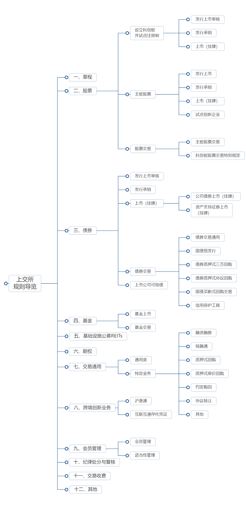

# awesome-stock-exchange-info

笔者在工作需要经常查询交易所的一些规则、接口等，经常会出现下面的情况：

- 有时接口版本更新等原因，下载到本地的资料不是最新的；
- 有些资料从网站查询之后又忘记了；
- 还有些环境配置等在某个文档里面，查询更新的时候又忘记了。

年纪大了。好记性不如烂笔头，对于国内外主流交易所业务规则、接口规范、指引、环境配置等进行汇总，便于查阅使用。

# 业务规则

本章内容包含了交易所股票、债券交易等规则。

## 交易规则

### 上交所

规则体系概述：[规则体系概述](http://www.sse.com.cn/lawandrules/sselawsrules/overview/)

### 深交所

最新规则：[最新规则](https://www.szse.cn/lawrules/rule/new/index.html)

# 接入服务指引

本章内容包含了交易所行情、交易环境接入环境、流程等指引。

## 上交所

系统接入：[上海证券交易所会员交易及相关系统接入与应用指引](http://www.sse.com.cn/services/tradingtech/services/c/SSE_TradeSystem_20200221.docx)

测试环境接入：[上海证券交易所全天候测试环境使用指引_20141215](http://www.sse.com.cn/services/tradingtech/services/c/SSE_TestingEnvironmentGuide_20141215.doc.doc)

QQ群服务：[上海证券交易所技术支持服务群使用指引(2016年1月版)](http://www.sse.com.cn/services/tradingtech/services/c/SSE_TechSupportIMGroupGuide_20160122.doc)

网关及专用数字证书服务: [网关及专用数字证书服务指南V1.0](http://www.sse.com.cn/services/tradingtech/services/c/SSE_KEY_TechnicalGuide_CV1.0_20220805.pdf)

期权及专用数字证书服务：[交易网关（期权）及专用证书开通申请指南](http://www.sse.com.cn/services/tradingtech/services/c/TDGW(DTP)_Key_Guide_20201215.pdf)

## 深交所

系统接入：[会员及其他相关单位访问深交所交易系统接入服务技术规范（Ver1.02）](http://www.szse.cn/marketServices/technicalservice/serveGuide/P020200403635505892547.pdf)

网关部署及接入指引：[[深圳证券交易所网关部署及接入指引](https://www.szse.cn/marketServices/technicalservice/serveGuide/P020191121321109599530.pdf)]

成交汇总接入：[深圳证券交易所成交汇总服务接入指引](https://www.szse.cn/marketServices/technicalservice/serveGuide/P020190822523987531097.pdf)

异地灾备系统接入：[深圳证券交易所交易异地灾备系统用户接入指引 Version（20181204）](https://www.szse.cn/marketServices/technicalservice/serveGuide/P020181210340141611667.pdf)

CA证书申请：[CA服务](https://www.szse.cn/marketServices/message/ca/index.html)

## 上证所信息网络有限公司

接入入口：[环境接入指引入口](https://www.sseinfo.com/services/assortment/document/)

上海证券交易所LDDS系统环境接入指引(1.1.1):[上海证券交易所LDDS系统环境接入指引(1.1.1)_20220126](https://www.sseinfo.com/services/assortment/document/additions/c/5690675.pdf)

# 技术服务

本章内容包含了技术接口规范。

## 上交所

技术通知：[技术通知](http://www.sse.com.cn/services/tradingtech/notice/)

IS101_上海证券交易所竞价撮合平台市场参与者接口规格说明书:_[IS101_上海证券交易所竞价撮合平台市场参与者接口规格说明书](http://www.sse.com.cn/services/tradingtech/data/c/IS101_PartTradInterface_CV1.61_20221020.pdf)]

IS105_上海证券交易所综合业务平台市场参与者接口规格说明书:_[IS105_上海证券交易所综合业务平台市场参与者接口规格说明书](http://www.sse.com.cn/services/tradingtech/data/c/IS105_ATPInterface_CV1.51_20221020.pdf)

IS118_上海证券交易所特定参与者接口规格说明书:_[IS118_上海证券交易所特定参与者接口规格说明书](http://www.sse.com.cn/services/tradingtech/data/c/IS118_SpecificInterface_Relay_CV1.1_20220804.pdf)

IS122_上海证券交易所交易网关STEP接口规格说明书（互联网交易平台）:_[IS122_上海证券交易所交易网关STEP接口规格说明书（互联网交易平台）](http://www.sse.com.cn/services/tradingtech/data/c/IS122_TDGW_STEP_CV1.12_IITP_20220818.pdf)

IS122_上海证券交易所交易网关Binary接口规格说明书（竞价平台）:_[IS122_上海证券交易所交易网关Binary接口规格说明书（竞价平台）](http://www.sse.com.cn/services/tradingtech/data/c/IS122_TDGW_Binary_CV0.53_MTP_20220715.pdf)

IS122_上海证券交易所交易网关STEP接口规格说明书（竞价平台）:_[IS122_上海证券交易所交易网关STEP接口规格说明书（竞价平台）](http://www.sse.com.cn/services/tradingtech/data/c/IS122_TDGW_STEP_CV0.53_MTP_20220715.pdf)

IS120_上海证券交易所行情网关BINARY数据接口规范:_[IS120_上海证券交易所行情网关BINARY数据接口规范](http://www.sse.com.cn/services/tradingtech/data/c/IS120_MDGW_BINARY_CV0.56_20220413.pdf)

IS120_上海证券交易所行情网关STEP数据接口规范:_[IS120_上海证券交易所行情网关STEP数据接口规范](http://www.sse.com.cn/services/tradingtech/data/c/IS120_MDGW_STEP_CV0.56_20220413.pdf)

## 深交所

技术公告：[技术公告](https://www.szse.cn/marketServices/technicalservice/notice/)

数据接口：[数据接口](https://www.szse.cn/marketServices/technicalservice/interface/)

深圳证券交易所Binary交易数据接口规范：[深圳证券交易所Binary交易数据接口规范（Ver1.26）](https://www.szse.cn/marketServices/technicalservice/interface/P020220927418890406491.pdf)

深圳证券交易所Binary行情数据接口规范：[深圳证券交易所Binary行情数据接口规范(Ver1.12)](https://www.szse.cn/marketServices/technicalservice/interface/P020220523530959450444.pdf)

深圳证券交易所数据文件交换接口规范：[深圳证券交易所数据文件交换接口规范（Ver1.35）](https://www.szse.cn/marketServices/technicalservice/interface/P020220916573746747357.pdf)

## 上证所网络信息有限公司

正式接口及开发测试接口说明书：[说明入口](https://www.sseinfo.com/services/assortment/document/)

低延迟行情发布系统（LDDS）接口说明书：

# 软件下载

本章内容包括了行情、交易等软件下载信息。

上交所：[上交所交易、行情网关等下载](http://www.sse.com.cn/services/tradingtech/download/)

深交所：[深交所交易、行情、文件网关等下载](https://biz.sscc.com/download.html)

深交所相关软件下载链接转到了**深证证券通信有限公司**。

# 交易日历

深交所交易日历：[交易日历](http://www.szse.cn/aboutus/calendar/index.html)

上交所交易日历：[交易日历](http://www.sse.com.cn/disclosure/dealinstruc/closed/)

​	

