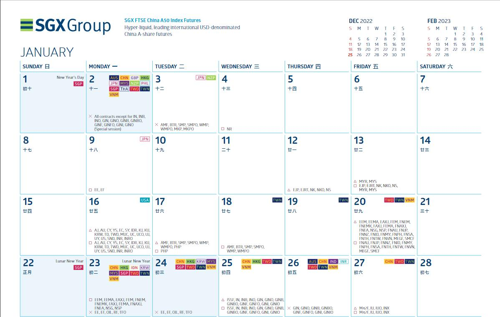

# 交易日历

深交所交易日历：[交易日历](http://www.szse.cn/aboutus/calendar/index.html)

上交所交易日历：[交易日历](http://www.sse.com.cn/disclosure/dealinstruc/closed/)

港交所交易日历：[交易日历](https://sc.hkex.com.hk/TuniS/www.HKEX.com.hk/News/HKEX-Calendar?sc_lang=zh-CN)

欧交所交易日历：[交易日历](https://www.eurex.com/ex-en/trade/trading-calendar)

- 觉得他们的网站日历展示不错，可以按照不同的产品进行查询。

新加坡交易所：[交易日历](https://www.sgx.com/derivatives/trading)

- 通过日历标识每天的交易状态：

  