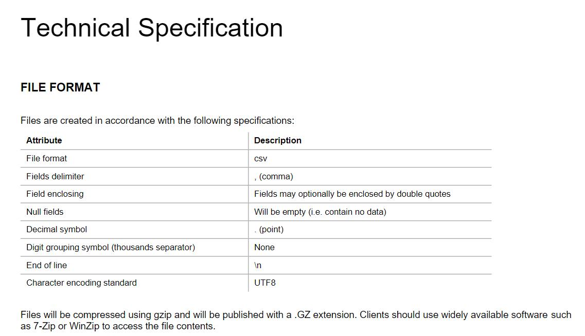
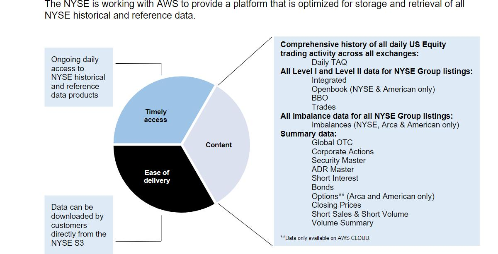

# 技术平台

对于交易所技术平台进行汇总。

## 上交所
[上海证券交易所交易及相关系统技术白皮书](https://www.ssetech.com.cn/news/notice/c/5711119.shtml)
上海证券交易所（以下简称“本所”）交易及相关系统包括交易系统、行情系统、通信网络、测试系统及其备份系统等。
《上海证券交易所交易及相关系统技术白皮书》（以下简称《技术白皮书》）根据本所交易及相关系统实际建设情况编制，
主要阐述本所交易及相关系统的相关架构、功能、网络通信及测试服务。
技术平台、客户端有：
- 竞价撮合平台Matching Transaction Platform（MTP）
- 综合业务平台Alternative Transaction Platform（ATP） 
- 期权业务平台Derivatives Transaction Platform（DTP） 
- 港股通平台International Transaction Platform（ITP）
- 新债券交易平台 Extreme Bond Transaction Platform(XBTP)
- 固定收益平台Fix Income Security Platform（FISP）
- 互联网交易平台Internet Innovation Transaction Platform（IITP）
- 交易网关TraDing GateWay（TDGW）
- 行情网关Market Data GateWay（MDGW）
- 行情接收客户端 Vendor Data Engine（VDE）

相关对应的技术文档清单如下：

## Nasdaq
[SoupBinTCP](https://www.nasdaq.com/docs/SoupBinTCP%204.1.pdf)
[Nordic OUCH 5 Specification](https://www.nasdaq.com/docs/2022/11/09/OUCH5-for-Nasdaq-Nordic-5.01.4_0.pdf)
### 市场数据源
[Nasdaq Market Data Feeds](https://www.nasdaq.com/solutions/nasdaq-market-data-feeds)
按照不同的分类包含了：
- [股票市场](https://www.nasdaq.com/solutions/nasdaq-equities-market-data-solution)
- [期权、期货市场](https://www.nasdaq.com/solutions/nasdaq-options-and-futures-market-data)
- [固定收益](https://www.nasdaq.com/solutions/fixed-income-market-data-reference-data-base)
- [商品](https://www.nasdaq.com/solutions/nasdaq-commodities-data)
- [指数](https://www.nasdaq.com/solutions/nasdaq-index-data-solution)
- [多资产](https://www.nasdaq.com/solutions/nasdaq-data-multi-asset-classes)

## 伦敦交易所集团
伦交所市场数据传输包含多个方面，不同数据分类规范不同。
### 历史数据产品
[历史数据产品](https://www.londonstockexchange.com/securities-trading/market-data/historical-data-products)
包含历史订单数据等，主要是通过文件方式对外提供：

### 实时数据
[实时数据概述](https://www.londonstockexchange.com/securities-trading/market-data/real-time-data-overview)
[Group Ticker Plant (GTP)](https://www.londonstockexchange.com/securities-trading/market-data/group-ticker-plant) 通过GTP平台进行数据发布
[Group Ticker Plant - Technical Specifications](https://www.londonstockexchange.com/resources/security-trading-resources/gtp-technical-specifications) GTP平台接口规范
## 纽交所
[数据产品概述](https://www.nyse.com/data-products) 
主要包含了实时数据、历史数据、公司事件、参考数据等
[NYSE Pillar平台](https://www.nyse.com/market-data/real-time/integrated-feed)

AWS云服务

纽交所通过和亚马逊云平台AWS的合作，可以让用户能够大规模的历史和参数数据。主要优势如下：

- 下载速度

  随着成交量增加、数据文件大小的递增，下载速度和效率已成为客户工作流程的一个重要方面，
  通过亚马逊云平台获取历史数据相较传统的SFTP传输系统速度快。

- 运营开销

  从SFTP下载文件、处理数据、将数据存储在本地或者存储到云供应商都需要一些工作；
  通过AWS云服务，用户可以花更少的时间和费用来维护基础设施。

  

[金融数据合规与金融云安全](https://aws.amazon.com/cn/financial-services/security-compliance/) 

## 德交所

[交易平台](https://www.eurex.com/ex-en/support/technology/t7)