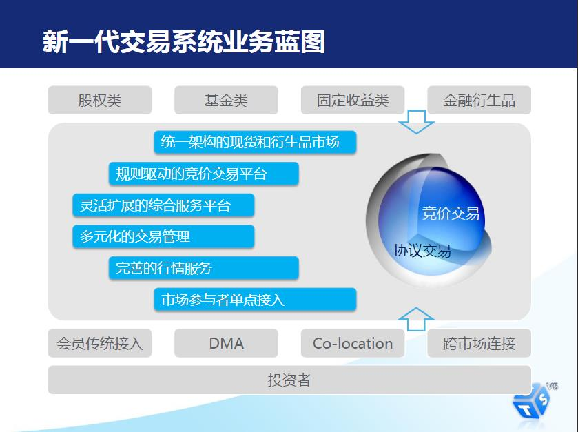
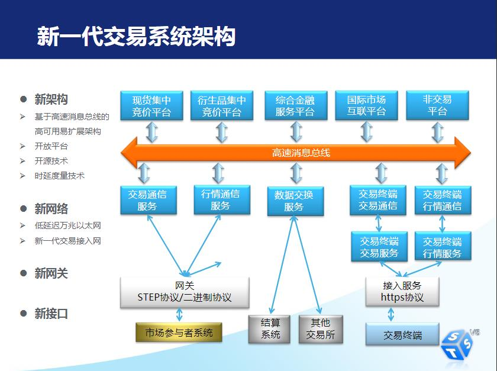
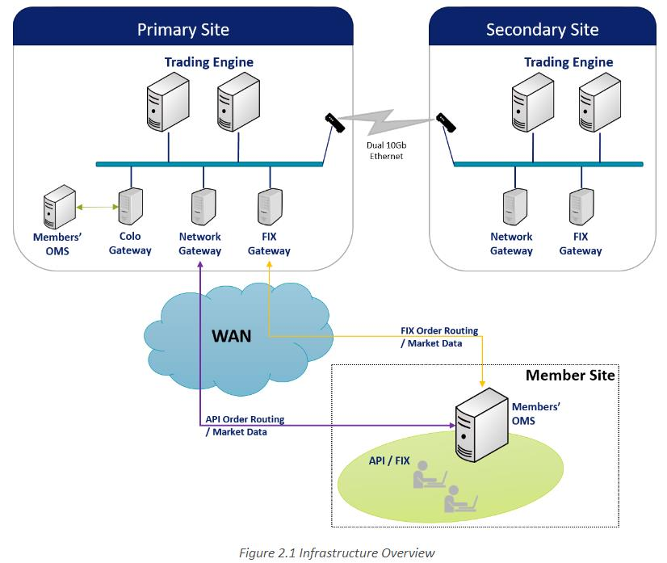

# 技术架构

对于交易所技术架构进行整理。

## 深交所

### 系统介绍

[深交所五版交易系统介绍](https://www.szse.cn/marketServices/technicalservice/introduce/)

业务蓝图：

系统架构：

### 参考链接

[第五代交易系统介绍](https://www.szse.cn/marketServices/technicalservice/introduce/)

[深交所码农眼中的第五代交易系统](https://www.szse.cn/aboutus/sse/documents/P020180328486251814979.pdf)

[深交所关键信息基础设施安全运营实践](https://www.secrss.com/articles/16971)

## 新加坡交易所

基本接入架构如下：

