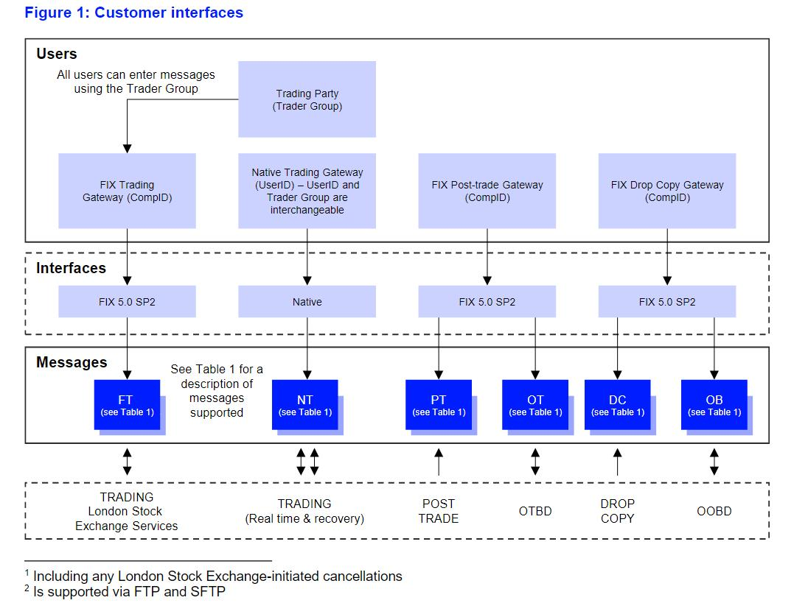
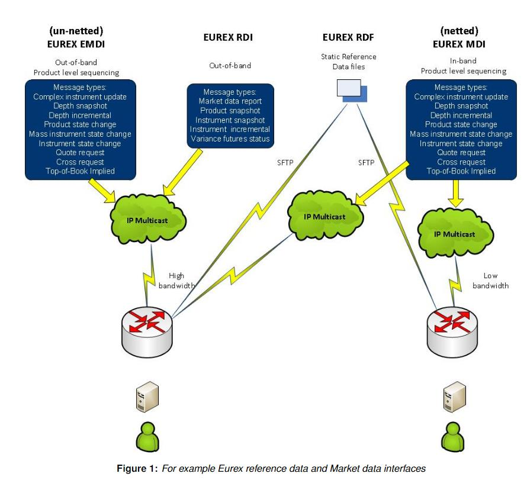
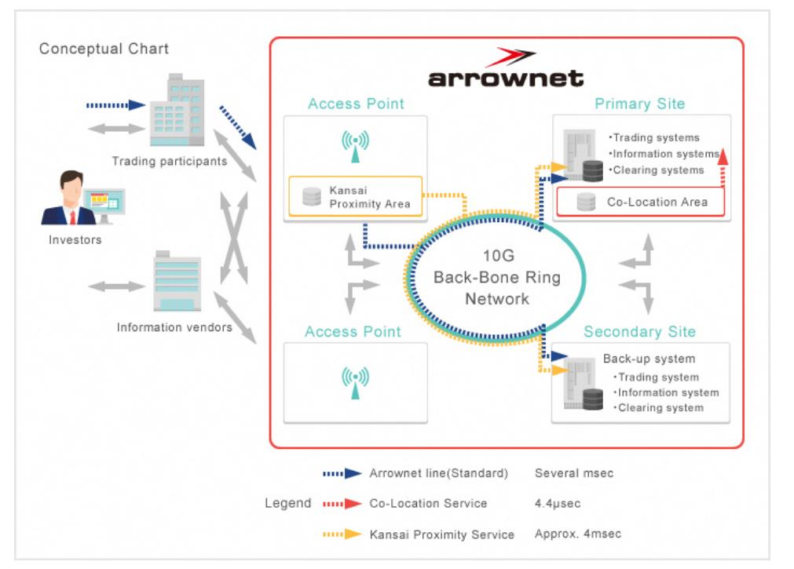

# 主要交易所接入服务指引

## 上交所

系统接入：[上海证券交易所会员交易及相关系统接入与应用指引](http://www.sse.com.cn/services/tradingtech/services/c/SSE_TradeSystem_20200221.docx)

测试环境接入：[上海证券交易所全天候测试环境使用指引_20141215](http://www.sse.com.cn/services/tradingtech/services/c/SSE_TestingEnvironmentGuide_20141215.doc.doc)

QQ群服务：[上海证券交易所技术支持服务群使用指引(2016年1月版)](http://www.sse.com.cn/services/tradingtech/services/c/SSE_TechSupportIMGroupGuide_20160122.doc)

网关及专用数字证书服务: [网关及专用数字证书服务指南V1.0](http://www.sse.com.cn/services/tradingtech/services/c/SSE_KEY_TechnicalGuide_CV1.0_20220805.pdf)

期权及专用数字证书服务：[交易网关（期权）及专用证书开通申请指南](http://www.sse.com.cn/services/tradingtech/services/c/TDGW(DTP)_Key_Guide_20201215.pdf)

## 深交所

系统接入：[会员及其他相关单位访问深交所交易系统接入服务技术规范（Ver1.02）](http://www.szse.cn/marketServices/technicalservice/serveGuide/P020200403635505892547.pdf)

网关部署及接入指引：[[深圳证券交易所网关部署及接入指引](https://www.szse.cn/marketServices/technicalservice/serveGuide/P020191121321109599530.pdf)]

成交汇总接入：[深圳证券交易所成交汇总服务接入指引](https://www.szse.cn/marketServices/technicalservice/serveGuide/P020190822523987531097.pdf)

异地灾备系统接入：[深圳证券交易所交易异地灾备系统用户接入指引 Version（20181204）](https://www.szse.cn/marketServices/technicalservice/serveGuide/P020181210340141611667.pdf)

CA证书申请：[CA服务](https://www.szse.cn/marketServices/message/ca/index.html)

## 上证所信息网络有限公司

接入入口：[环境接入指引入口](https://www.sseinfo.com/services/assortment/document/)

上海证券交易所LDDS系统环境接入指引(1.1.1):[上海证券交易所LDDS系统环境接入指引(1.1.1)_20220126](https://www.sseinfo.com/services/assortment/document/additions/c/5690675.pdf)

## 上海期货交易所

接入指引：[上海期货交易所期货公司会员交易接入指引](https://www.shfe.com.cn/upload/dir_20110301/11141_20110301.doc)

网络管理：[上海期货交易所会员与信息服务商接入和使用交易专网管理规范](https://www.shfe.com.cn/upload/dir_20110301/22399_20110301.doc)

## 香港证券交易所

基础设施接入入口：[基础设施](https://sc.hkex.com.hk/TuniS/www.hkex.com.hk/Services/Connectivity/SDNet_2?sc_lang=zh-HK)

【香港交易所领航星】市场数据平台 (OMD)系统设施：[系统设施](https://sc.hkex.com.hk/TuniS/www.hkex.com.hk/Services/Market-Data-Services/Infrastructure?sc_lang=zh-HK)

## 新加坡交易所

市场接入：[市场接入](https://www.sgx.com/data-connectivity/market-access)

交易参与者主要通过两种方式接入市场：

- SGXAccess API
- SGXAccess FIX

## 伦交所

数据中心接入：[数据中心接入](https://www.londonstockexchange.com/resources/securities-trading-resources?tab=technical-library&accordionId=0-c17336cd-5d4f-4124-aedd-45a31948d2c7&moduleId=block_content%3Aeee54ed9-7327-4e91-8bf3-b3ee7e01c570)

用户接口：

## 欧洲交易所

接入支持：[接入支持](https://www.eurex.com/ex-en/support/technology/connectivity)

## 日本交易所集团

接入服务：[接入服务](https://www.jpx.co.jp/english/systems/connectivity/index.html)

